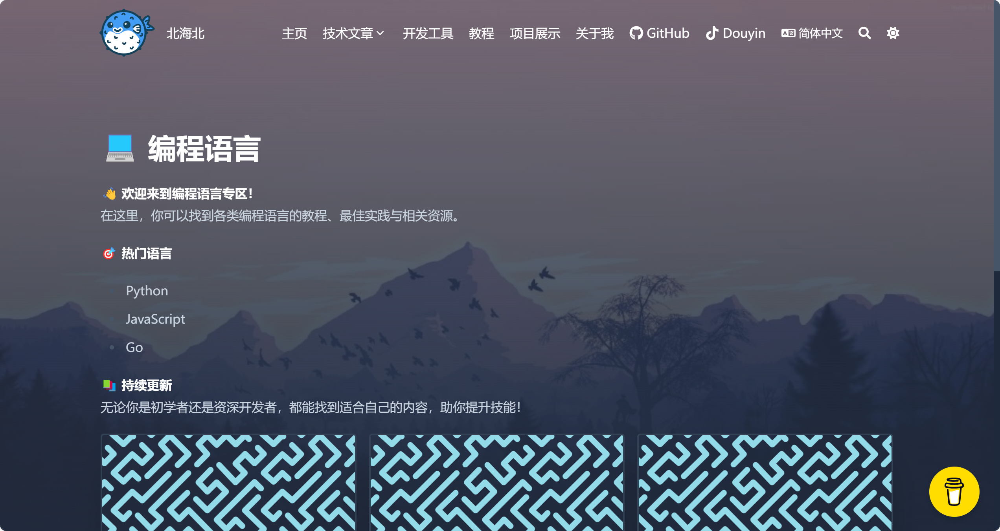

# 我的个人博客与作品集


> 一个展示我的简历、计算机专业知识及更多内容的个人博客与作品集。

[English Version](README.md)

## 📋 目录
- 项目概览
- 功能特点
- 技术栈
- 截图展示
- 快速开始
- 使用说明
- 贡献指南
- 许可证
- 联系方式

## 🌟 项目概览

该项目是我的个人博客与作品集网站，用于展示我的简历、记录我的计算机专业知识，并发布教程和技术文章。它是一个展示我技能和经验的专业在线平台。

## ✨ 功能特点

- 简历部分：详细介绍了我的职业经历、教育背景和技能。
- 博客：发布与计算机科学相关的各种主题的文章，包括教程、最佳实践和行业见解。
- 项目展示：展示我的项目，包括描述、截图和源代码链接。
- 响应式设计：全响应式布局，适用于桌面、平板和移动设备。
- 搜索功能：使用搜索功能快速查找文章和项目。

## 🛠 技术栈

- 前端：HTML, CSS, JavaScript, Bootstrap
- 后端：Node.js, Express.js
- 数据库：MongoDB
- 版本控制：Git, GitHub
- 部署：GitHub Pages, Heroku

## 📷 截图展示


*说明：展示简短介绍和推荐文章的首页。*


*说明：详细展示职业经历和技能的简历部分。*


*说明：关于计算机科学主题的示例博客文章。*

## 🚀 快速开始

### 前提条件

- 在你的计算机上安装了 Node.js 和 npm。
- 设置并运行 MongoDB。

### 安装步骤

1. 克隆仓库：
   
   ```bash
   git clone git@github.com:Beihai-North/my-blog.git
   ```
   
2. 进入项目目录：
   ```bash
   cd my-blog
   ```
   
3. 安装依赖：
   ```bash
   npm install
   ```
   
4. 启动开发服务器：
   ```bash
   npm start
   ```
   
   

## 📚 使用说明

- 本地开发：在 http://localhost:3000 访问本地站点。
- 生产环境：使用 GitHub Pages 或其他托管服务部署站点。

## 🤝 贡献指南

欢迎贡献！请遵循以下步骤：

1. Fork 此仓库。
2. 创建一个新分支 (git checkout -b feature/AmazingFeature)。
3. 提交你的更改 (git commit -m 'Add some AmazingFeature')。
4. 推送到分支 (git push origin feature/AmazingFeature)。
5. 打开一个 Pull Request。

## 📝 许可证

该项目依据 MIT 许可证开源 - 详情请参阅 LICENSE 文件。

## 📬 联系方式

- GitHub：Beihai-North
- 电子邮件：jinhai.ma@icloud.com

欢迎查看我的项目，如有任何问题或建议，请随时联系我！